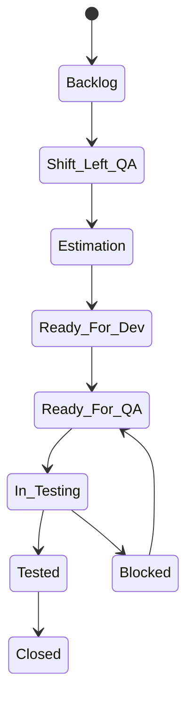

# Product Backlog Items (PBI) — Bunkai

> Phase 4 discovery date: 2026-07-12
> PM tool: Jira Cloud
> Project key: `BK`
> Instance: `https://upexgalaxy69.atlassian.net/`
> Source of truth: Jira. Local `.md` files marked `[SYNC]` are read-only cache.

## Backlog Location

| Item | Value | Source |
|---|---|---|
| Tracker | Jira Cloud | `.agents/project.yaml` |
| Project key | `BK` | `.agents/project.yaml:7-10` |
| Site URL | `https://upexgalaxy69.atlassian.net/` | `.agents/project.yaml:25-29` |
| Board | Not verified live | Discovery gap |
| Flow | Jira workflow, exact states not verified live | Discovery gap |

## Access Configuration

### Primary Method

Use repo sync scripts for detailed Jira reads, because custom fields and comments are materialized into the `.context/PBI/` tree:

```bash
bun run jira:sync-issues get BK-123 --include-comments
bun run jira:sync-issues jql "project = BK AND updated >= -1d ORDER BY updated DESC"
bun run jira:sync-fields --force
bun run jira:sync-workflows
bun run jira:check
```

### CLI / Tool Fallback

For transitions, links, simple issue operations, and traceability graph checks, use `acli` after loading `/acli`:

```bash
acli jira issue view BK-123
```

### Required Env Vars

Credentials live only in `.env`; never paste values into markdown.

```bash
ATLASSIAN_URL=
ATLASSIAN_EMAIL=
ATLASSIAN_API_TOKEN=
```

Optional operational overrides:

```bash
JIRA_PROJECT_KEY=BK
JIRA_SYNC_OUTPUT=.context/PBI
JIRA_SYNC_TYPES=Story,Bug,Defect,Improvement,Tech Story,Tech Debt
```

## Project Structure

| Work Type | Local Cache Location | Notes |
|---|---|---|
| Epic | `.context/PBI/epics/EPIC-BK-<key>-<slug>/` | Module = Epic (1:1). |
| Story | `epics/.../stories/STORY-BK-<key>-<slug>/` | Synced from Jira by `/sprint-testing`. |
| Bug | `.context/PBI/bugs/BUG-BK-<key>-<slug>/` | Coverable issue with ATP/ATR/evidence. |
| Defect | `.context/PBI/defects/` or nested under coverable parent | QA process issue; parent bucket is QA Defect Management. |
| Improvement | `.context/PBI/improvements/IMPROVEMENT-BK-<key>-<slug>/` | Enhancement/under-specified AC output. |
| Test | `.context/PBI/tests/` | TMS/Jira-native test issue cache. |
| Test Plan / Execution | `.context/PBI/test-plans/`, `.context/PBI/test-executions/` | Xray container cache when modality uses Xray. |

### Workflow State Diagram

Exact Jira workflow names were not verified live in Phase 4. Current methodology expects this QA flow:



Before using transitions in automation, verify real state names with:

```bash
bun run jira:sync-workflows
```

## Common Queries

| Need | Jira JQL |
|---|---|
| Current sprint ready for QA | `project = BK AND sprint in openSprints() AND status = "Ready For QA"` |
| All open bugs | `project = BK AND type = Bug AND resolution = Unresolved ORDER BY priority DESC` |
| My testing tasks | `project = BK AND status = "In Testing" AND assignee = currentUser()` |
| Recently updated | `project = BK AND updated >= -1d ORDER BY updated DESC` |
| Shift-left candidates | `project = BK AND type = Story AND status in (Backlog, "Shift-Left QA", Estimation, "Ready For Dev") ORDER BY priority DESC` |

Use sync script for detailed content:

```bash
bun run jira:sync-issues jql "project = BK AND sprint in openSprints() AND status = \"Ready For QA\""
```

## Integration With KATA

| Skill | When it reads PBI | Local Output Rule |
|---|---|---|
| `/shift-left-testing` | Before sprint, AC refinement | Push AC/ATP draft to Jira field/comment, then sync. |
| `/sprint-testing` | Per Story/Bug QA | Sync issue first; `[SYNC]` files are read-only. |
| `/test-documentation` | TMS/ROI documentation | Creates/links Test/Test Plan/Test Execution through Jira/Xray tools. |
| `/test-automation` | Candidate automation handoff | Reads synced Story/TC plus local non-Jira `test-specs/`. |

## Local Storage Layout

```text
.context/PBI/
  README.md                                      # backlog access recipe
  templates/                                    # format-reference guides only
    user-story.md
    bug-report.md
    test-plan.md
  epic-tree.md                                  # [SYNC] master index
  epics/EPIC-BK-<key>-<slug>/                   # [SYNC] epic cache
    epic.md                                     # [SYNC]
    feature-implementation-plan.md              # [SYNC]
    feature-test-plan.md                        # [SYNC]
    module-context.md                           # skill-authored, non-Jira
    test-specs/                                 # skill-authored, non-Jira
    stories/STORY-BK-<key>-<slug>/              # [SYNC] story cache
      story.md                                  # [SYNC]
      acceptance-criteria.md                    # [SYNC]
      business-rules.md                         # [SYNC]
      scope.md                                  # [SYNC]
      out-of-scope.md                           # [SYNC]
      workflow.md                               # [SYNC]
      mockup.md                                 # [SYNC]
      implementation-plan.md                    # [SYNC]
      acceptance-test-plan.md                   # [SYNC]
      acceptance-test-results.md                # [SYNC]
      comments.md                               # [SYNC]
      context.md                                # skill-authored, non-Jira
      test-session-memory.md                    # skill-authored, non-Jira
      shift-left-refinement.md                  # skill-authored, non-Jira
      test-cases/                               # skill-authored, non-Jira
      evidence/                                 # skill-authored, non-Jira
```

## `[SYNC]` vs Skill-Authored

- `[SYNC]` files mirror Jira/Xray fields and comments. Do not edit by hand; they are overwritten by sync.
- Skill-authored files store QA analysis not owned by Jira, such as session notes, `test-specs/`, `evidence/`, and automation plans.
- Flow is always: generate content → push to Jira field or structured fallback comment → run `jira:sync-issues` → read local cache.

## Format Reference Guides

These templates describe expected shape only. They are not per-ticket authoring targets:

- `.context/PBI/templates/user-story.md`
- `.context/PBI/templates/bug-report.md`
- `.context/PBI/templates/test-plan.md`

## Credentials

- Jira credentials: `.env` keys `ATLASSIAN_URL`, `ATLASSIAN_EMAIL`, `ATLASSIAN_API_TOKEN`.
- Jira custom field catalog: `.agents/jira-fields.json` after `bun run jira:sync-fields --force`.
- Jira workflow catalog: `.agents/jira-workflows.json` after `bun run jira:sync-workflows`.
- Required field manifest: `.agents/jira-required.yaml`.

## Discovery Gaps

- [ ] Jira live access was not exercised in Phase 4; board name, issue types in use, and actual workflow transitions need verification.
- [ ] `jira-fields.json` / `jira-workflows.json` were not found in this checkout during Phase 4 scan.
- [ ] Exact sprint cadence and current sprint name were not verified.
- [ ] Required custom fields must be validated with `bun run jira:check` before write-heavy QA sessions.
- [ ] The workflow diagram above reflects methodology defaults, not live Jira evidence.
