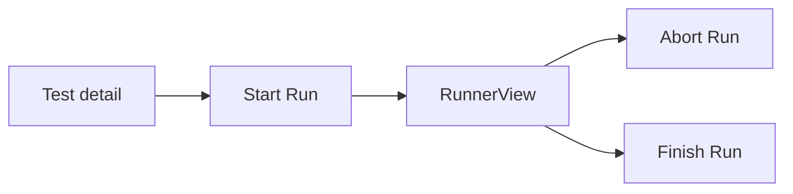

# User Journeys — Bunkai

> Discovery date: 2026-07-12
> Rutas reales derivadas de `app/**/page.tsx`; flujos extendidos contrastados con PRD/SRS existentes.

## Route Map

### Public Routes (Unauthenticated)

| Route | Page | Purpose |
|---|---|---|
| `/` | `app/page.tsx` | Redirige a `/projects` si hay usuario, a `/login` si no |
| `/login` | `app/(auth)/login/page.tsx` | Login público |
| `/invites/accept` | `app/invites/accept/page.tsx` | Aceptar invitación |
| `/api/docs` | `app/api/docs/page.tsx` | Documentación Scalar/OpenAPI |
| `/api/openapi` | `app/api/openapi/route.ts` | OpenAPI JSON público |
| `/qa` | `app/qa/page.tsx` | Guía QA/testability |
| `/design-tokens` | `app/design-tokens/page.tsx` | Referencia visual/tokens |

### Protected Routes (Authenticated)

| Route | Page | Requires | Purpose |
|---|---|---|---|
| `/onboarding` | `app/(app)/onboarding/page.tsx` | Usuario autenticado | Onboarding de app/workspace |
| `/projects` | `app/(app)/projects/page.tsx` | Usuario autenticado | Lista/entrada a proyectos |
| `/projects/[projectSlug]` | `app/(app)/projects/[projectSlug]/page.tsx` | Workspace member | Project workbench |
| `/projects/[projectSlug]/atcs/new` | `app/(app)/projects/[projectSlug]/atcs/new/page.tsx` | Workspace member | Crear ATC |
| `/projects/[projectSlug]/atcs/[atcId]` | `app/(app)/projects/[projectSlug]/atcs/[atcId]/page.tsx` | Workspace member | Ver/editar ATC |
| `/projects/[projectSlug]/tests/new` | `app/(app)/projects/[projectSlug]/tests/new/page.tsx` | Workspace member | Crear Test |
| `/projects/[projectSlug]/tests/[testId]` | `app/(app)/projects/[projectSlug]/tests/[testId]/page.tsx` | Workspace member | Ver Test |
| `/projects/[projectSlug]/runs/[runId]` | `app/(app)/projects/[projectSlug]/runs/[runId]/page.tsx` | Workspace member; write actions require `member/admin/owner` | Runner detail |
| `/workspaces/[id]/members` | `app/(app)/workspaces/[id]/members/page.tsx` | Workspace admin/owner expected | Gestión de miembros |

### Dynamic Routes

| Pattern | Example | Purpose |
|---|---|---|
| `/projects/[projectSlug]` | `/projects/bunkai` | Workbench del proyecto |
| `/projects/[projectSlug]/atcs/[atcId]` | `/projects/bunkai/atcs/uuid` | ATC detail |
| `/projects/[projectSlug]/tests/[testId]` | `/projects/bunkai/tests/uuid` | Test detail |
| `/projects/[projectSlug]/runs/[runId]` | `/projects/bunkai/runs/uuid` | Run detail/runner |
| `/workspaces/[id]/members` | `/workspaces/uuid/members` | Workspace members |

## Journey 1 — Login y entrada al workspace

### Persona + Goal + Discovered From

- Persona: Elena / cualquier usuario.
- Goal: entrar a la app y aterrizar en proyectos/onboarding según estado.
- Sources: `app/page.tsx:8-12`, `middleware.ts:8-51`.

```mermaid
flowchart LR
  Root[/ /] --> Auth{User?}
  Auth -- No --> Login[/login]
  Auth -- Yes --> Projects[/projects]
  Projects --> Onboarding[/onboarding]
```

| Step | Page | Action | Next | Evidence |
|---|---|---|---|---|
| 1 | `/` | Usuario entra al root | Auth decision | `app/page.tsx:8-12` |
| 2 | `/login` | Usuario no autenticado es redirigido | Login form | `app/page.tsx:11`, `middleware.ts:48-51` |
| 3 | `/projects` | Usuario autenticado entra a app | Project list/workbench | `app/page.tsx:11` |
| 4 | Protected route | Usuario no auth intenta entrar | Redirect `/login?next=...` | `middleware.ts:48-51` |

### Error Paths

| Error | Handling | Evidence |
|---|---|---|
| Usuario no autenticado en ruta protegida | Redirect a `/login` con `next` | `middleware.ts:48-51` |
| Sesión Supabase stale | Middleware refresca cookies vía SSR client | `middleware.ts:22-44` |

### Success Criteria

- [ ] Usuario autenticado desde `/` termina en `/projects`.
- [ ] Usuario anónimo desde `/` termina en `/login`.
- [ ] Ruta protegida conserva `next` para volver después de login.

## Journey 2 — Crear ATC anclado a Story/AC

### Persona + Goal + Discovered From

- Persona: Elena.
- Goal: crear un ATC válido dentro de proyecto/workspace.
- Sources: `app/(app)/projects/[projectSlug]/atcs/new/page.tsx:15-100`, `lib/atcs/validation.ts:35-47`.

```mermaid
flowchart LR
  Project[/projects/:slug] --> NewATC[/atcs/new]
  NewATC --> Load[Load modules + stories + ACs]
  Load --> Editor[NewAtcEditor]
  Editor --> Save[POST/PATCH ATC]
```

| Step | Page | Action | Next | Evidence |
|---|---|---|---|---|
| 1 | `/projects/[projectSlug]` | Usuario abre workbench | Selecciona crear ATC | `app/(app)/projects/[projectSlug]/page.tsx:12-28` |
| 2 | `/atcs/new` | Sistema resuelve active workspace | Project lookup scoped | `app/(app)/projects/[projectSlug]/atcs/new/page.tsx:20-43` |
| 3 | `/atcs/new` | Sistema carga módulos no archivados | Module picker | `app/(app)/projects/[projectSlug]/atcs/new/page.tsx:45-58` |
| 4 | `/atcs/new` | Sistema carga stories + ACs visibles | Anchoring panel | `app/(app)/projects/[projectSlug]/atcs/new/page.tsx:59-73` |
| 5 | `/atcs/new?story=&ac=` | Deep-link opcional pre-ancla story/AC | Editor inicializado | `app/(app)/projects/[projectSlug]/atcs/new/page.tsx:75-99` |
| 6 | API/validation | Save valida body | ATC creado/editado | `lib/atcs/validation.ts:35-47` |

### Error Paths

| Error | Handling | Evidence |
|---|---|---|
| Project slug no visible en workspace activo | `notFound()` | `app/(app)/projects/[projectSlug]/atcs/new/page.tsx:33-43` |
| Deep-link story/ac inválido | Se ignora pre-anchor extranjero/stale | `app/(app)/projects/[projectSlug]/atcs/new/page.tsx:75-88` |
| ATC sin steps o sin AC | Zod schema falla | `lib/atcs/validation.ts:35-47` |

### Success Criteria

- [ ] ATC no puede anclarse a material archivado o de otro proyecto.
- [ ] `acceptance_criterion_ids` debe tener al menos un UUID.
- [ ] Steps debe tener al menos un step.

## Journey 3 — Ejecutar y cerrar Run

### Persona + Goal + Discovered From

- Persona: Elena o Karim.
- Goal: ejecutar un Test como Run y terminarlo con resultado.
- Sources: `app/(app)/projects/[projectSlug]/runs/[runId]/page.tsx:14-70`, `lib/runs/validation.ts:16-65`.



| Step | Page | Action | Next | Evidence |
|---|---|---|---|---|
| 1 | Test/API | Crear Run con `test_id` y `environment_id` | `run_id` | `lib/runs/validation.ts:16-26` |
| 2 | `/runs/[runId]` | Usuario abre Run | Expanded run read | `app/(app)/projects/[projectSlug]/runs/[runId]/page.tsx:42-49` |
| 3 | `/runs/[runId]` | Sistema calcula permiso de manage | Enable abort/finish | `app/(app)/projects/[projectSlug]/runs/[runId]/page.tsx:50-69` |
| 4 | API | Abort con reason 3..500 | Run aborted | `lib/runs/validation.ts:30-45` |
| 5 | API | Finish con `passed|failed` | Run terminal | `lib/runs/validation.ts:49-65` |

### Error Paths

| Error | Handling | Evidence |
|---|---|---|
| Usuario no auth | `notFound()` | `app/(app)/projects/[projectSlug]/runs/[runId]/page.tsx:25-27` |
| Run no visible/foreign workspace | `notFound()` no-disclosure | `app/(app)/projects/[projectSlug]/runs/[runId]/page.tsx:42-47` |
| Abort reason demasiado corto/largo | Mensajes AC-exact | `lib/runs/validation.ts:30-45` |
| Finish sin verdict válido | Mensaje AC-exact | `lib/runs/validation.ts:49-65` |

### Success Criteria

- [ ] Viewer ve Runner read-only.
- [ ] Member/admin/owner puede abort/finish.
- [ ] Finish solo acepta `passed` o `failed`.
- [ ] Abort requiere reason 3..500 chars.

## Journey 4 — API/Agent execution

### Persona + Goal + Discovered From

- Persona: Karim.
- Goal: consumir API con PAT y OpenAPI.
- Sources: `app/api/v1/route.ts:12-19`, `app/api/openapi/route.ts:4-26`, `lib/api/handler.ts:12-25`, `lib/api/pat.ts:8-28`.

```mermaid
flowchart LR
  Agent[AI Agent/CLI] --> Spec[/api/openapi]
  Agent --> V1[/api/v1]
  Agent --> PAT[Bearer bk_pat]
  PAT --> Routes[Protected API routes]
```

| Step | Page/API | Action | Next | Evidence |
|---|---|---|---|---|
| 1 | `/api/v1` | Discover API banner | Paths to OpenAPI/docs | `app/api/v1/route.ts:12-19` |
| 2 | `/api/openapi` | Leer spec | JSON cached | `app/api/openapi/route.ts:14-25` |
| 3 | API protected | Enviar Bearer PAT | Principal resolved | `lib/api/handler.ts:17-21`, `lib/api/pat.ts:8-28` |
| 4 | API protected | Crear/leer recursos según scopes | JSON response | `lib/api/handler.ts:61-92` |

### Error Paths

| Error | Handling | Evidence |
|---|---|---|
| Ruta no public sin auth | Handler resuelve identity y falla antes de business logic | `lib/api/handler.ts:71-82` |
| Scope admin global inválido | `workspace:admin` rechazado en headless auth | `lib/api/pat.ts:30-40` |
| Request body inválido | ZodError -> 422 validation envelope | `lib/api/handler.ts:112-124` |

### Success Criteria

- [ ] `/api/v1` devuelve `status: live`, `openapi`, `docs`.
- [ ] `/api/openapi` devuelve JSON público con cache headers.
- [ ] PAT scopes limitan capacidades sin self-escalation.

## Navigation Structure

```mermaid
graph LR
  Public[Public] --> Root[/]
  Public --> Login[/login]
  Public --> Docs[/api/docs]
  Public --> OpenAPI[/api/openapi]
  Protected[Authenticated] --> Projects[/projects]
  Projects --> Workbench[/projects/:projectSlug]
  Workbench --> ATCs[/atcs/new + /atcs/:id]
  Workbench --> Tests[/tests/new + /tests/:id]
  Workbench --> Runs[/runs/:id]
  Protected --> Members[/workspaces/:id/members]
```

## Breadcrumb Patterns

| Path | Breadcrumb |
|---|---|
| `/projects` | Projects |
| `/projects/[projectSlug]` | Projects / `[projectSlug]` |
| `/projects/[projectSlug]/atcs/[atcId]` | Projects / `[projectSlug]` / ATCs / `[atcId]` |
| `/projects/[projectSlug]/tests/[testId]` | Projects / `[projectSlug]` / Tests / `[testId]` |
| `/projects/[projectSlug]/runs/[runId]` | Projects / `[projectSlug]` / Runs / `[runId]` |

## Critical Paths

### Happy Paths (Must Work)

| Journey | Start | End | Business Impact |
|---|---|---|---|
| Login routing | `/` | `/projects` | Entrada a producto |
| ATC creation | Project workbench | ATC persisted | Unidad central de valor |
| Run lifecycle | Test detail/API | Finished run | Evidencia de ejecución |
| API discovery | `/api/v1` | OpenAPI loaded | Agent/CLI enablement |

### Unhappy Paths (Must Handle)

| Scenario | Expected Behavior | Evidence |
|---|---|---|
| No auth on protected route | Redirect to `/login?next=...` | `middleware.ts:48-51` |
| Foreign workspace resource | `notFound()` no-disclosure | `app/(app)/projects/[projectSlug]/runs/[runId]/page.tsx:42-47` |
| Invalid ATC body | Validation failure | `lib/atcs/validation.ts:35-47` |
| Invalid run finish/abort body | AC-exact error message | `lib/runs/validation.ts:30-65` |

## Discovery Gaps

| Flow | Unknown | Question |
|---|---|---|
| Workspace onboarding | Exact empty-state UX not fully inspected | ¿Qué datos mínimos crea onboarding? |
| Members management | Role UI and invite edge cases need deeper read | ¿Qué roles se pueden invitar desde UI? |
| Bugs | Native Bug route/schema not confirmed in route list | ¿Bug feature está MVP real o documentada para futuro? |
| CI agent | Nightly execution not wired in repo | ¿Dónde vive scheduler/CI? |

## QA Relevance

### Critical E2E Test Scenarios

| Priority | Scenario | Journey Reference |
|---|---|---|
| P0 | Anonymous user redirected to login, authenticated user to projects | Journey 1 |
| P0 | Create ATC with valid Story/AC and reject invalid anchoring | Journey 2 |
| P0 | Start/read/abort/finish Run with correct permissions | Journey 3 |
| P1 | PAT with limited scopes can read/execute but not admin | Journey 4 |

### Suggested Test Data

| Journey | Test User | Prerequisites |
|---|---|---|
| Login routing | member user | Existing workspace + session |
| ATC creation | member user | Project, module, user story, AC |
| Run lifecycle | member/admin + viewer | Test with ATC chain + environment |
| API agent | PAT principal | Generated PAT with scopes |
