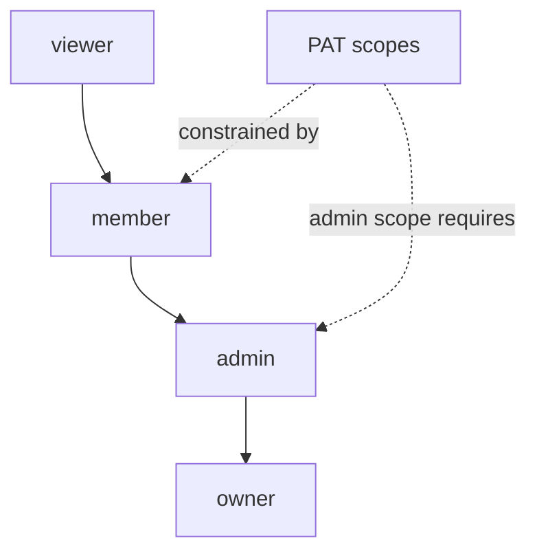

# User Personas — Bunkai

> Discovery date: 2026-07-12
> Personas derivadas de roles, permisos, docs de producto y superficies reales UI/API.

## Persona Discovery Summary

| Persona | System Role | Access Level | Primary Goal |
|---|---|---|---|
| Elena — Senior QA Engineer | `member` | Write dentro de workspace/proyecto | Crear ATCs, Tests y ejecutar Runs con trazabilidad |
| Mateo — QA Lead / Manager | `admin` / `owner` | Administración workspace + reporting | Ver cobertura, gestionar equipo y preparar evidencia |
| Sara — Developer Collaborator | `member` / `viewer` según equipo | Lectura o colaboración limitada | Entender si una feature está cubierta y ver bugs con contexto |
| Karim — AI Test Agent | PAT principal | Scopes `atc:read`, `atc:write`, `run:execute` | Consumir API y reportar ejecución automatizada |

## Persona 1 — Elena, Senior QA Engineer

### Identity

| Campo | Valor |
|---|---|
| System Role | `member` |
| Evidence | `../upex-bunkai-tms/.context/PRD/user-personas.md:7-42`, `../upex-bunkai-tms/lib/api/pat.ts:24-28` |
| Access Level | Puede crear/modificar entidades de proyecto según RBAC documentado |
| Estimated % of Users | No verificado |

### Goals

| Goal | Supporting Feature | Route/Component |
|---|---|---|
| Crear ATCs reutilizables | New ATC editor | `app/(app)/projects/[projectSlug]/atcs/new/page.tsx` |
| Ejecutar tests manuales | RunnerView | `app/(app)/projects/[projectSlug]/runs/[runId]/page.tsx` |
| Mantener trazabilidad | ATC anchoring a Story/AC | `lib/atcs/validation.ts:35-47` |

### Pain Points

| Pain Point | Evidence |
|---|---|
| Duplicación de pasos en TMS tradicionales | `../upex-bunkai-tms/.context/PRD/user-personas.md:25-31` |
| Reportes que no explican riesgo real | `../upex-bunkai-tms/.context/PRD/user-personas.md:27-30` |
| Bugs sin contexto de run/ATC | `../upex-bunkai-tms/.context/PRD/user-personas.md:29` |

### Feature Access

| Feature | Access | Evidence |
|---|---|---|
| ATC authoring | Full | `app/(app)/projects/[projectSlug]/atcs/new/page.tsx:90-100` |
| Manual run | Full si rol `member/admin/owner` | `app/(app)/projects/[projectSlug]/runs/[runId]/page.tsx:50-69` |
| Project workbench | Full | `app/(app)/projects/[projectSlug]/page.tsx:12-28` |

### User Journey Summary

`Login -> Project -> Module -> User Story/AC -> ATC -> Test -> Run -> Result`

### Profile Attributes

- Email/user identity proviene de Supabase Auth.
- Workspace role proviene de `workspace_members.role`.
- Active workspace se resuelve por cookie y membresía.

Representative Quote (inferred): “Necesito que cada ATC diga qué requisito cubre y que editarlo no rompa histórico.”

## Persona 2 — Mateo, QA Lead / Quality Engineering Manager

### Identity

| Campo | Valor |
|---|---|
| System Role | `admin` / `owner` |
| Evidence | `../upex-bunkai-tms/.context/PRD/user-personas.md:45-79`, `../upex-bunkai-tms/lib/api/pat.ts:49-88` |
| Access Level | Gestión de workspace, miembros, tokens admin y reporting |
| Estimated % of Users | No verificado |

### Goals

| Goal | Supporting Feature | Route/Component |
|---|---|---|
| Gestionar miembros | Workspace members page | `app/(app)/workspaces/[id]/members/page.tsx` |
| Emitir tokens admin controlados | PAT issuance role gate | `lib/api/pat.ts:49-88` |
| Ver estado de runs/defects | Run pages + project workbench | `app/(app)/projects/[projectSlug]/runs/[runId]/page.tsx` |

### Pain Points

| Pain Point | Evidence |
|---|---|
| No puede responder coverage con confianza | `../upex-bunkai-tms/.context/PRD/user-personas.md:56-68` |
| Auditoría requiere evidencia trazable | `../upex-bunkai-tms/.context/PRD/user-personas.md:63-68` |
| Vendor lock-in de TMS actuales | `../upex-bunkai-tms/.context/PRD/user-personas.md:68` |

### Feature Access

| Feature | Access | Evidence |
|---|---|---|
| Workspace admin tokens | Full para `admin/owner` | `lib/api/pat.ts:49-88` |
| Invite/member management | Full según role | `app/api/v1/workspaces/[id]/invites/route.ts`, `app/(app)/workspaces/[id]/members/page.tsx` |
| Run management | Full si `member/admin/owner` | `app/(app)/projects/[projectSlug]/runs/[runId]/page.tsx:50-69` |

### User Journey Summary

`Login -> Workspace -> Members/Projects -> Coverage/Runs -> Review risks -> Report`

Representative Quote (inferred): “Necesito trazabilidad que pueda mostrar sin reconstruirla a mano.”

## Persona 3 — Sara, Developer Collaborator

### Identity

| Campo | Valor |
|---|---|
| System Role | `member` o `viewer` |
| Evidence | `../upex-bunkai-tms/.context/PRD/user-personas.md:82-114`, `../upex-bunkai-tms/.context/SRS/architecture-specs.md:134-142` |
| Access Level | Lectura o colaboración limitada según política del equipo |
| Estimated % of Users | No verificado |

### Goals

| Goal | Supporting Feature | Route/Component |
|---|---|---|
| Ver si feature está cubierta | Project workbench table/mindmap | `app/(app)/projects/[projectSlug]/page.tsx:12-28` |
| Entender bug con contexto | Run detail and linked ATC flow | `app/(app)/projects/[projectSlug]/runs/[runId]/page.tsx:14-70` |
| Consultar API/spec | OpenAPI + docs | `app/api/openapi/route.ts:4-26`, `app/api/v1/route.ts:12-19` |

### Feature Access

| Feature | Access | Evidence |
|---|---|---|
| Read project artifacts | Full/Limited según role | `../upex-bunkai-tms/.context/SRS/architecture-specs.md:134-142` |
| Modify runs/ATCs | None/Limited según role | `app/(app)/projects/[projectSlug]/runs/[runId]/page.tsx:50-69` |

### User Journey Summary

`PR/Story -> Bunkai project -> ATCs/Tests -> Run/Bug evidence -> Fix confidence`

Representative Quote (inferred): “Si veo el ATC y el Run exacto, puedo arreglar sin perseguir contexto.”

## Persona 4 — Karim, AI Test Agent

### Identity

| Campo | Valor |
|---|---|
| System Role | Bearer PAT principal |
| Evidence | `../upex-bunkai-tms/.context/PRD/user-personas.md:117-146`, `lib/api/pat.ts:8-28` |
| Access Level | Scope-limited API access |
| Estimated % of Users | No aplica |

### Goals

| Goal | Supporting Feature | Route/Component |
|---|---|---|
| Leer contratos y tests | API v1 + OpenAPI | `app/api/v1/route.ts:12-19`, `app/api/openapi/route.ts:4-26` |
| Ejecutar runs | `run:execute` scope | `lib/api/pat.ts:12-28`, `lib/runs/validation.ts:10-26` |
| Reportar resultados | Run abort/finish/start API | `app/api/v1/runs/**/*.ts` |

### Feature Access

| Feature | Access | Evidence |
|---|---|---|
| ATC read/write | Por scopes `atc:read`, `atc:write` | `lib/api/pat.ts:12-28` |
| Run execution | Por scope `run:execute` | `lib/api/pat.ts:12-28` |
| Workspace admin | Solo admin/owner específico | `lib/api/pat.ts:49-88` |

### User Journey Summary

`GET /api/openapi -> authenticate PAT -> fetch Test -> start Run -> post results -> finish Run`

Representative Quote (inferred): “Dame API determinista y devuelvo resultados reproducibles.”

## Role Hierarchy

## Permission Matrix

| Permission | viewer | member | admin | owner | PAT |
|---|---:|---:|---:|---:|---:|
| Read workspace/project | Yes | Yes | Yes | Yes | scope-dependent |
| Create/edit ATCs | No | Yes | Yes | Yes | `atc:write` |
| Execute runs | No | Yes | Yes | Yes | `run:execute` |
| Manage members/invites | No | No | Yes | Yes | `workspace:admin` only if authorized |
| Issue admin PAT | No | No | Yes | Yes | No self-escalation |

## Discovery Gaps

| Gap | Why It Matters | Question to Ask |
|---|---|---|
| Porcentaje real por persona | Priorización UX y test accounts | ¿Quiénes serán usuarios piloto? |
| Test accounts por rol | Necesario para E2E y API auth | ¿Existen usuarios staging viewer/member/admin/owner? |
| Permisos finales de developer collaborator | Afecta coverage de Sara | ¿Developer será viewer o member por defecto? |

## QA Relevance

### Test Account Requirements

| Persona | Test Account | Permissions Needed |
|---|---|---|
| Elena | `STAGING_MEMBER_EMAIL` / pendiente | `member` activo |
| Mateo | `STAGING_ADMIN_EMAIL` / pendiente | `admin` u `owner` activo |
| Sara | `STAGING_VIEWER_EMAIL` / pendiente | `viewer` o `member` según política |
| Karim | PAT en `.auth/tokens.env` / pendiente | `atc:read`, `run:execute` |

### Critical Persona Flows to Test

- Elena: crear ATC anclado a story/AC y luego crear Test.
- Mateo: crear invite/token admin y verificar que un member no pueda emitir `workspace:admin`.
- Sara: acceso read-only no debe mostrar acciones de write.
- Karim: PAT con scope limitado no debe acceder a acciones fuera de scope.
