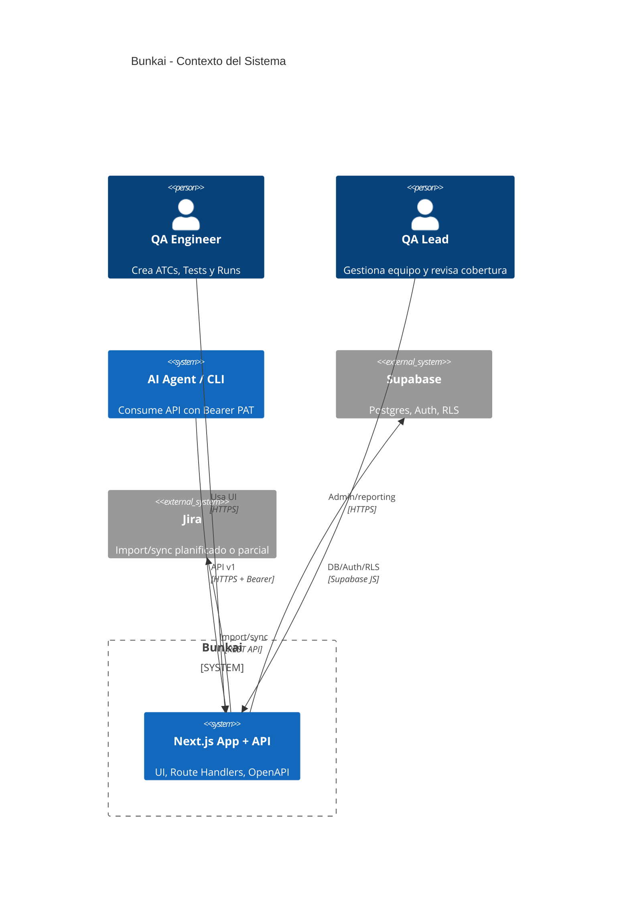
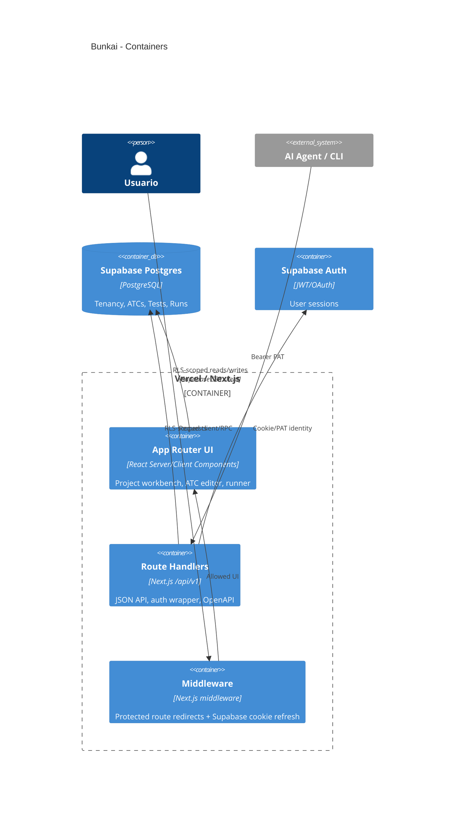
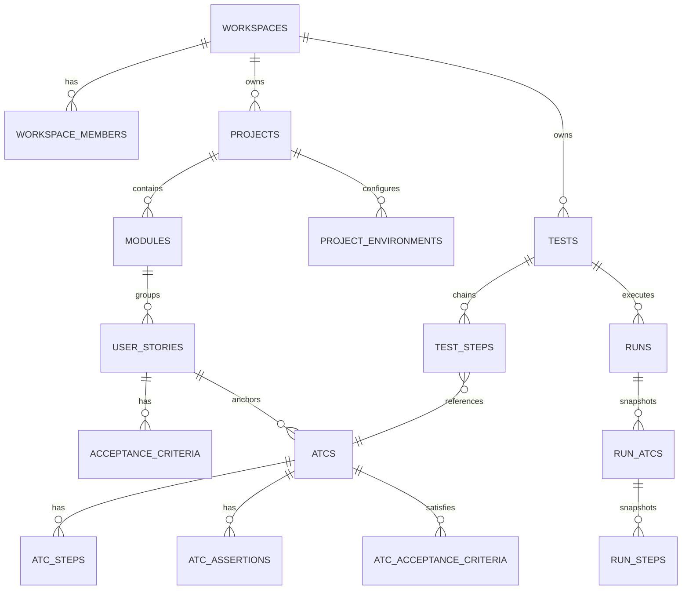
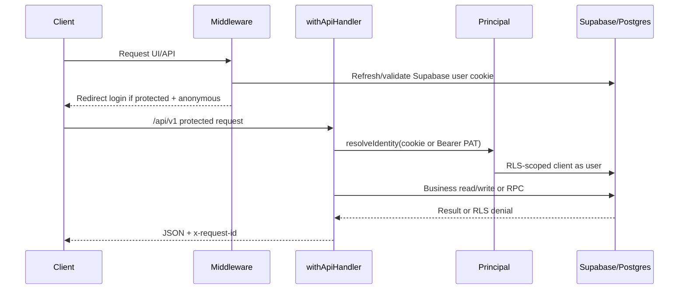
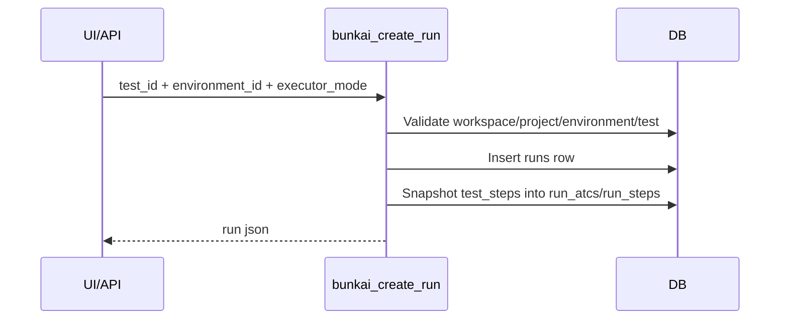

# Architecture Specification — Bunkai

> Discovery date: 2026-07-12
> Repo objetivo: `../upex-bunkai-tms`
> Nota: este SRS describe lo verificado desde código, migraciones y docs versionados. Features futuras quedan en `Discovery Gaps`.

## System Overview

Bunkai es un monorepo full-stack Next.js 15. La UI vive en `app/` con App Router; la API vive en `app/api/v1/**` como Route Handlers; la persistencia usa Supabase/Postgres con RLS, migraciones SQL y RPCs `SECURITY DEFINER` para operaciones complejas.

| Layer | Tecnología | Evidencia |
|---|---|---|
| Frontend | Next.js 15 App Router + React 19 + TypeScript | `../upex-bunkai-tms/package.json:67-70`, `../upex-bunkai-tms/app/**/page.tsx` |
| API | Next.js Route Handlers `/api/v1` | `../upex-bunkai-tms/app/api/v1/route.ts:12-19` |
| Auth web | Supabase SSR cookie session | `../upex-bunkai-tms/middleware.ts:19-55` |
| Auth API | Cookie session o Bearer PAT unificados como `Principal` | `../upex-bunkai-tms/lib/api/principal.ts:12-25` |
| DB | Supabase/Postgres con RLS | `../upex-bunkai-tms/supabase/migrations/0001_tenancy.sql:57-61` |
| API docs | OpenAPI JSON + Scalar docs | `../upex-bunkai-tms/app/api/openapi/route.ts:4-26`, `../upex-bunkai-tms/app/api/v1/route.ts:12-19` |

## C4 Context Diagram

## C4 Container Diagram

## Component Structure

| Path | Responsibility | Evidence |
|---|---|---|
| `app/(auth)/login` | Login público | `../upex-bunkai-tms/app/(auth)/login/page.tsx` |
| `app/(app)/projects` | Project list/workbench entry | `../upex-bunkai-tms/app/(app)/projects/page.tsx` |
| `app/(app)/projects/[projectSlug]` | Workbench route-driven: table/mindmap/explorer | `../upex-bunkai-tms/app/(app)/projects/[projectSlug]/page.tsx:12-28` |
| `app/(app)/projects/[projectSlug]/atcs` | ATC create/detail UI | `../upex-bunkai-tms/app/(app)/projects/[projectSlug]/atcs/new/page.tsx:15-100` |
| `app/(app)/projects/[projectSlug]/runs` | Runner/read-only run detail | `../upex-bunkai-tms/app/(app)/projects/[projectSlug]/runs/[runId]/page.tsx:14-70` |
| `app/api/v1/**` | REST-ish API route handlers | `../upex-bunkai-tms/app/api/v1/route.ts:12-19` |
| `lib/api/**` | Handler wrapper, Principal, PAT, idempotency, error envelope | `../upex-bunkai-tms/lib/api/handler.ts:12-25` |
| `lib/*/validation.ts` | Zod/business validation per domain | `../upex-bunkai-tms/lib/atcs/validation.ts`, `../upex-bunkai-tms/lib/runs/validation.ts` |
| `supabase/migrations/*.sql` | DB schema, RLS, RPCs | `../upex-bunkai-tms/supabase/migrations/` |

## Database Schema

| Table | Key columns | Notes | Evidence |
|---|---|---|---|
| `workspaces` | `id`, `slug`, `name`, `owner_user_id`, `plan` | Tenant boundary | `supabase/migrations/0001_tenancy.sql:27-35` |
| `workspace_members` | `workspace_id`, `user_id`, `role`, `status` | RBAC join | `supabase/migrations/0001_tenancy.sql:40-49` |
| `projects` | `id`, `workspace_id`, `slug`, `name` | App under test | `supabase/migrations/0002_projects_modules.sql:17-25` |
| `modules` | `id`, `project_id`, `parent_module_id`, `path` | Tree max depth 6 | `supabase/migrations/0002_projects_modules.sql:109-121` |
| `user_stories` | `id`, `module_id`, `title`, `external_id` | Business intent | `supabase/migrations/0003_authoring.sql:15-23` |
| `acceptance_criteria` | `id`, `user_story_id`, `position` | Sortable ACs | `supabase/migrations/0003_authoring.sql:122-130` |
| `atcs` | `id`, `project_id`, `module_id`, `user_story_id`, `layer`, `version`, `status`, `tags` | Acceptance Test Case | `supabase/migrations/0004_atcs.sql:53-69` |
| `atc_steps` | `id`, `atc_id`, `position`, `content`, `input_data`, `expected` | Ordered ATC steps | `supabase/migrations/0004_atcs.sql:179-187` |
| `tests` | `id`, `workspace_id`, `title`, `created_by` | Test chain header | `supabase/migrations/0024_tests.sql:40-49` |
| `test_steps` | `id`, `test_id`, `atc_id`, `position` | Ordered ATC references | `supabase/migrations/0024_tests.sql:60-68` |
| `project_environments` | `id`, `project_id`, `name` | Run targets | `supabase/migrations/0031_runs.sql:30-40` |
| `runs` | `id`, `workspace_id`, `project_id`, `test_id`, `environment_id`, `status`, `executor_mode` | Run header | `supabase/migrations/0031_runs.sql:72-90` |
| `run_atcs` | `id`, `run_id`, `atc_id`, `position`, `status` | ATC snapshot | `supabase/migrations/0031_runs.sql:120-129` |
| `run_steps` | `id`, `run_atc_id`, `atc_step_id`, `position`, `status`, `note`, `evidence_url` | Step snapshot | `supabase/migrations/0031_runs.sql:163-179` |

## Data Flow

### Request + Auth Sequence

### Run Creation Snapshot

## External Services

| Service | Role | Integration Point | Evidence |
|---|---|---|---|
| Supabase Auth | Web auth/session | `createServerClient`, `supabase.auth.getUser()` | `middleware.ts:19-44` |
| Supabase Postgres | DB + RLS | Supabase JS + migrations/RPCs | `supabase/migrations/*.sql` |
| Jira | Import/sync source | `lib/jira/*`, imports routes | `../upex-bunkai-tms/lib/jira/import-runner.ts`, `app/api/v1/imports/**` |
| Resend | Transactional email likely | `.env.example:73-80` | `.env.example` |
| Vercel | Hosting/deploy target | Project docs/config | `.context/SRS/architecture-specs.md:1-4` |

## Security Architecture

- **AuthN web:** Supabase session cookie; protected prefixes `/projects` and `/onboarding`. Evidence: `middleware.ts:8-51`.
- **AuthN API:** `withApiHandler` defaults to auth required unless `auth: 'public'`. Evidence: `lib/api/handler.ts:40-82`.
- **Principal model:** cookie and Bearer PAT collapse into single `Principal`, with RLS-scoped DB client. Evidence: `lib/api/principal.ts:12-25`.
- **PAT scopes:** `atc:read`, `atc:write`, `run:execute`, `workspace:admin`; admin scope requires workspace-specific admin/owner. Evidence: `lib/api/pat.ts:12-28`, `lib/api/pat.ts:49-88`.
- **RLS:** workspace membership drives access; write gates generally require `member/admin/owner`. Evidence: `supabase/migrations/0001_tenancy.sql:67-210`, `supabase/migrations/0002_projects_modules.sql:47-103`.
- **Error mapping:** `ApiError` and Zod errors map centrally with request id. Evidence: `lib/api/handler.ts:94-124`.

## Performance Hooks

- ATC search uses `tsvector` + GIN index. Evidence: `supabase/migrations/0004_atcs.sql:8-10`, `supabase/migrations/0004_atcs.sql:71-75`.
- Module tree depth capped at 6 for bounded recursive queries. Evidence: `supabase/migrations/0002_projects_modules.sql:4-7`, `supabase/migrations/0002_projects_modules.sql:118-120`.
- Run reads use composed JSON RPC (`bunkai_run_json`, `bunkai_get_run_expanded`). Evidence: `supabase/migrations/0031_runs.sql:213-280`.
- OpenAPI route is static/cached 300s. Evidence: `app/api/openapi/route.ts:14-24`.

## Discovery Gaps

- [ ] CI/CD real no verificado; no `.github/workflows/*` en target repo.
- [ ] Bugs native schema/API no confirmado en rutas leídas; docs lo describen, pero requiere verificación DB/live.
- [ ] Observability real (Sentry/PostHog) no verificada en código activo.
- [ ] Rate limiting no verificado en middleware/API; NFR lo documenta pero no se observó implementación en Phase 2.
- [ ] No se consultó DB live; migraciones se tratan como fuente de verdad local.

## QA Relevance

- Probar auth parity: cookie vs PAT deben producir mismo acceso RLS cuando corresponde.
- Probar workspace isolation con usuarios multi-workspace y recursos con mismo slug.
- Probar ATC anchoring y validación de steps/ACs.
- Probar Test chain con ATC repetido y reorder.
- Probar Run snapshots: cambios de ATC no deben alterar histórico.
- Probar OpenAPI drift: comparar `public/openapi.json` contra route handlers críticos.
