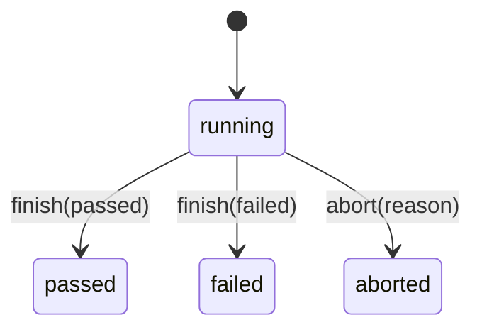

# Functional Specifications — Bunkai

> Discovery date: 2026-07-12
> IDs estables para QA: `FR-001+`, `BR-001+`.

## Specification Index

| FR | Feature | Category | Priority |
|---|---|---|---|
| FR-001 | Auth routing and protected access | Auth | P0 |
| FR-002 | Workspace/Project/Module tenancy | Tenancy | P0 |
| FR-003 | User Story + Acceptance Criteria authoring | Authoring | P0 |
| FR-004 | ATC authoring and validation | ATC | P0 |
| FR-005 | Test chain creation/reorder | Tests | P0 |
| FR-006 | Run lifecycle | Runs | P0 |
| FR-007 | API v1 + OpenAPI + PAT auth | API | P0 |
| FR-008 | Project environments management | Environments | P1 |
| FR-009 | Jira import | Integration | P1 |

## FR-001: Auth routing and protected access

| Aspect | Value |
|---|---|
| Related PRD | Login y entrada al workspace |
| Service/method | Next middleware + root page |
| Evidence | `app/page.tsx:8-12`, `middleware.ts:8-51` |

**Functional Requirement:** el sistema debe redirigir usuarios anónimos a `/login` y usuarios autenticados a `/projects`, protegiendo rutas internas.

### Input Specification

| Field | Rule |
|---|---|
| Supabase session cookie | Requerida para `/projects` y `/onboarding` |
| `next` query param | Se conserva al redirigir desde protected route |

### Processing Logic

1. Root `/` consulta `supabase.auth.getUser()`.
2. Si hay usuario, redirige a `/projects`; si no, a `/login`.
3. Middleware valida rutas protegidas y redirige a `/login?next=...` si falta user.

### Output Specification

| Case | Output |
|---|---|
| Authenticated root | Redirect `/projects` |
| Anonymous root | Redirect `/login` |
| Anonymous protected route | Redirect `/login?next=<path>` |

### Business Rules

| BR | Rule |
|---|---|
| BR-001 | Rutas internas no deben revelar contenido sin sesión. |

### Edge Cases

| Case | Expected |
|---|---|
| Stale session cookie | Middleware refresca via Supabase SSR client |
| Asset/static path | Excluido por matcher |

## FR-002: Workspace/Project/Module tenancy

| Aspect | Value |
|---|---|
| Related PRD | Project workbench |
| Service/method | DB RLS + active workspace resolution |
| Evidence | `supabase/migrations/0001_tenancy.sql:27-61`, `supabase/migrations/0002_projects_modules.sql:17-121`, `app/(app)/projects/[projectSlug]/atcs/new/page.tsx:20-43` |

**Functional Requirement:** el sistema debe aislar recursos por workspace y resolver projects/modules dentro del active workspace del usuario.

### Input Specification

| Field | Rule |
|---|---|
| `workspace_id` | Debe tener membership `active` |
| `projectSlug` | Único por workspace, no global |
| `module.path` | Profundidad 1..6 |

### Processing Logic

1. Resolver workspaces visibles para el usuario.
2. Leer cookie active workspace.
3. Buscar project por `(workspace_id, slug)`.
4. RLS limita select/mutations a miembros activos.

### Business Rules

| BR | Rule |
|---|---|
| BR-002 | `projectSlug` debe resolverse dentro del active workspace. |
| BR-003 | `viewer` es read-only; `member/admin/owner` puede escribir. |
| BR-004 | Module tree tiene profundidad máxima 6. |

### Edge Cases

| Case | Expected |
|---|---|
| Same slug en dos workspaces | Active workspace decide cuál se abre |
| Module depth > 6 | DB CHECK rechaza |
| Usuario sin workspace activo | `notFound()` o redirect/onboarding según route |

## FR-003: User Story + Acceptance Criteria authoring

| Aspect | Value |
|---|---|
| Related PRD | ATC anchoring |
| Service/method | `user_stories`, `acceptance_criteria` tables/routes |
| Evidence | `supabase/migrations/0003_authoring.sql:15-130`, `app/api/v1/modules/[id]/user-stories/route.ts`, `app/api/v1/user-stories/[id]/acceptance-criteria/route.ts` |

**Functional Requirement:** el sistema debe permitir crear stories bajo modules y ACs ordenables bajo stories para anclar ATCs.

### Input Specification

| Field | Rule |
|---|---|
| `title` | Requerido |
| `description` | Markdown opcional |
| `external_id` | Jira key opcional |
| `position` | Orden de AC |

### Business Rules

| BR | Rule |
|---|---|
| BR-005 | Una User Story pertenece a un Module. |
| BR-006 | Un Acceptance Criterion pertenece a una User Story. |
| BR-007 | ACs son ordenables por `position`. |

### Edge Cases

| Case | Expected |
|---|---|
| Foreign module/story | RLS/route must deny |
| Duplicate AC position | Unique `(user_story_id, position)` blocks |

## FR-004: ATC authoring and validation

| Aspect | Value |
|---|---|
| Related PRD | ATC creation journey |
| Service/method | `NewAtcEditor`, ATC API, `AtcWriteBodySchema` |
| Evidence | `app/(app)/projects/[projectSlug]/atcs/new/page.tsx:45-99`, `lib/atcs/validation.ts:9-91`, `supabase/migrations/0004_atcs.sql:53-187` |

**Functional Requirement:** el sistema debe crear/editar ATCs con title, layer, steps, assertions y AC links obligatorios.

### Input Specification

| Field | Rule |
|---|---|
| `title` | 3..200 chars |
| `layer` | `UI`, `API`, `Unit` |
| `steps` | Array min 1; content <= 2048 bytes |
| `assertions` | Array opcional; content <= 2048 bytes |
| `acceptance_criterion_ids` | Array min 1 UUID |
| `tags` | Max 10 |

### Validation Rules

Fuente: `lib/atcs/validation.ts:9-47`.

### Processing Logic

1. UI carga modules no archivados.
2. UI carga stories y ACs visibles por proyecto.
3. Deep-link `story/ac` solo se honra si apunta a material visible.
4. API valida shape y persistencia inserta ATC + steps + assertions + joins.

### Business Rules

| BR | Rule |
|---|---|
| BR-008 | ATC debe estar anclado a `user_story_id` y ≥1 AC. |
| BR-009 | Step positions deben ser enteros crecientes empezando en 1. |
| BR-010 | ATC layer debe ser uno de `UI/API/Unit`. |

### Edge Cases

| Case | Expected |
|---|---|
| Step positions `[0, 2]` | `steps_position_invalid` |
| Content multibyte > 2048 bytes | Validation failure |
| Stale deep-link AC | No pre-anchor |

## FR-005: Test chain creation/reorder

| Aspect | Value |
|---|---|
| Related PRD | Tests as ATC chains |
| Service/method | `bunkai_create_test`, test routes |
| Evidence | `supabase/migrations/0024_tests.sql:1-34`, `supabase/migrations/0024_tests.sql:40-68`, `supabase/migrations/0024_tests.sql:174-220` |

**Functional Requirement:** el sistema debe crear Tests como cadenas ordenadas de referencias a ATCs, preservando duplicados y orden.

### Input Specification

| Field | Rule |
|---|---|
| `title` | Trimmed 1..200 chars |
| `atc_ids` | Array min 1 |
| `workspace_id` | Actor debe poder escribir |

### Business Rules

| BR | Rule |
|---|---|
| BR-011 | Test chain referencia ATCs; no copia contenido. |
| BR-012 | El mismo `atc_id` puede aparecer múltiples veces; `test_steps.id` identifica la fila. |
| BR-013 | ATCs foreign/nonexistent/null colapsan en error no-disclosing. |

### Edge Cases

| Case | Expected |
|---|---|
| Empty chain | Error `chain_empty` |
| Foreign ATC | Error uniforme sin exponer id |
| Duplicate ATC in chain | Permitido, posiciones separadas |

## FR-006: Run lifecycle

| Aspect | Value |
|---|---|
| Related PRD | Manual execution / agent execution |
| Service/method | `bunkai_create_run`, Run routes, `RunCreateBodySchema` |
| Evidence | `supabase/migrations/0031_runs.sql:1-24`, `supabase/migrations/0031_runs.sql:72-179`, `lib/runs/validation.ts:16-65` |

**Functional Requirement:** el sistema debe crear Runs contra un environment, snapshotear ATCs/steps y permitir abort/finish con reglas específicas.

### Input Specification

| Field | Rule |
|---|---|
| `test_id` | UUID |
| `environment_id` | UUID del proyecto |
| `executor_mode` | `human`, `agent`, `ci` |
| `start_token` | Opcional, 1..200 chars |
| `abort.reason` | 3..500 chars |
| `finish.verdict` | `passed` o `failed` |

### Business Rules

| BR | Rule |
|---|---|
| BR-014 | Crear Run debe snapshotear test title, ATCs y steps. |
| BR-015 | `aborted` se alcanza por acción abort; finish solo acepta `passed|failed`. |
| BR-016 | Viewer no puede abortar/terminar; member/admin/owner sí. |

### State Machine

### Edge Cases

| Case | Expected |
|---|---|
| Abort reason corto | Mensaje: `Please give a reason of at least 3 characters` |
| Finish sin verdict | Mensaje: `Select a final verdict of passed or failed to finish the run.` |
| Run foreign workspace | `notFound()` / no-disclosure |

## FR-007: API v1 + OpenAPI + PAT auth

| Aspect | Value |
|---|---|
| Related PRD | API-first / agentic |
| Service/method | `/api/v1`, `/api/openapi`, `withApiHandler`, PAT helpers |
| Evidence | `app/api/v1/route.ts:12-19`, `app/api/openapi/route.ts:4-26`, `lib/api/handler.ts:61-140`, `lib/api/pat.ts:8-175` |

**Functional Requirement:** el sistema debe exponer API introspectable y autenticable por cookie o PAT.

### Input Specification

| Field | Rule |
|---|---|
| `Authorization: Bearer bk_pat_...` | Opcional para routes protegidas; cookie también soportada |
| PAT scopes | `atc:read`, `atc:write`, `run:execute`, `workspace:admin` |
| OpenAPI | Disponible en `/api/openapi` |

### Business Rules

| BR | Rule |
|---|---|
| BR-017 | Todas las routes protegidas son auth-required por defecto. |
| BR-018 | Cookie y PAT deben converger en `Principal`. |
| BR-019 | PAT `workspace:admin` requiere workspace y rol admin/owner. |

## FR-008: Project environments management

| Aspect | Value |
|---|---|
| Related PRD | Run targeting |
| Service/method | `project_environments`, environment CRUD RPCs |
| Evidence | `supabase/migrations/0031_runs.sql:30-66`, `supabase/migrations/0032_project_environments_crud.sql:37-135` |

**Functional Requirement:** el sistema debe administrar environments por proyecto y bloquear delete cuando haya runs referenciándolo.

### Business Rules

| BR | Rule |
|---|---|
| BR-020 | Environment names únicos por proyecto case-insensitive. |
| BR-021 | Name trim 1..50 a nivel app/RPC. |
| BR-022 | Delete se bloquea si ≥1 Run referencia el environment. |

## FR-009: Jira import

| Aspect | Value |
|---|---|
| Related PRD | Import User Stories / ACs |
| Service/method | `lib/jira/*`, `/api/v1/imports` |
| Evidence | `../upex-bunkai-tms/lib/jira/import-runner.ts`, `../upex-bunkai-tms/app/api/v1/imports/route.ts` |

**Functional Requirement:** el sistema debe importar stories/ACs desde Jira de forma controlada.

### Discovery Status

Implementación detectada por archivos/rutas, pero requiere lectura profunda en Phase 3 o `/business-api-map` para confirmar estados, errores y límites.

## Business Rules Summary

| BR | Summary |
|---|---|
| BR-001 | Rutas internas requieren sesión. |
| BR-002 | Project slug scoped por workspace activo. |
| BR-003 | Viewer read-only; member/admin/owner write. |
| BR-004 | Module depth max 6. |
| BR-008 | ATC requiere story + ≥1 AC. |
| BR-011 | Test referencia ATCs, no copia contenido. |
| BR-014 | Run snapshot preserva histórico. |
| BR-018 | Cookie/PAT convergen en Principal. |
| BR-022 | Environment con Runs no se borra. |

## Validation Rules Catalog

| Entity | Field | Rules | Evidence |
|---|---|---|---|
| Module | path | Depth 1..6 | `supabase/migrations/0002_projects_modules.sql:118-120` |
| ATC | title | 3..200 | `lib/atcs/validation.ts:16-17` |
| ATC | layer | `UI/API/Unit` | `lib/atcs/validation.ts:9-10` |
| ATC | steps | min 1, positions increasing | `lib/atcs/validation.ts:39-42`, `lib/atcs/validation.ts:76-91` |
| Test | title | trim 1..200 | `supabase/migrations/0024_tests.sql:24-34` |
| Run | executor_mode | `human/agent/ci` | `lib/runs/validation.ts:10-21` |
| Run abort | reason | 3..500 | `lib/runs/validation.ts:30-45` |
| Run finish | verdict | `passed/failed` | `lib/runs/validation.ts:49-65` |
| Idempotency | header | 8..128 `[a-zA-Z0-9_-]` | `lib/api/idempotency.ts:29-31`, `lib/api/idempotency.ts:198-210` |

## Discovery Gaps

- [ ] Bugs native route/schema requiere confirmación.
- [ ] Jira import requiere lectura detallada de runner y rutas para error handling completo.
- [ ] Feature map canonical (`business-feature-map.md`) pendiente de comando standalone.
- [ ] No se verificó DB live; validaciones derivadas de migraciones/código local.

## QA Relevance

- Cada FR genera casos positivos, negativos, permisos y aislamiento.
- Boundary-value obligatorio para límites: ATC title 3/200, content 2048 bytes, abort reason 3/500, environment name 1/50.
- State-transition obligatorio para Run lifecycle.
- Decision-table para role × action × auth method (cookie/PAT).
