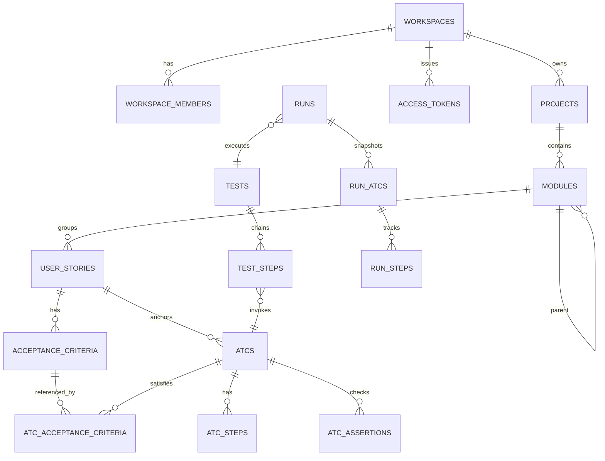
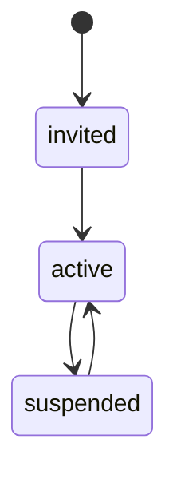
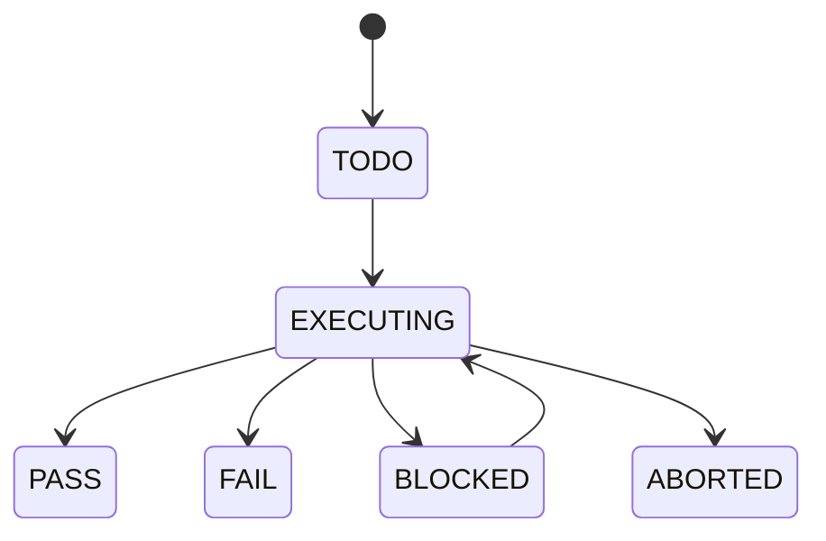

# Glosario de Dominio — Bunkai

> Fuente de vocabulario para QA del producto Bunkai.
> Regla: los nombres técnicos, nombres de tabla, rutas, env vars y constantes se conservan en inglés; las definiciones operativas se documentan en español.

## Aclaración crítica sobre ATC

**ATC = Acceptance Test Case.** No significa “Atomic Test Component”.

La confusión existe porque un ATC automatizado suele tener arquitectura atómica y vive dentro de un componente KATA, pero esas son propiedades de implementación, no el significado del acrónimo. Fuente: `../upex-bunkai-tms/.context/business/domain-glossary.md:11-25`.

## Core Entities

### Workspace

| Technical Name | Business Name | Description | Table/Collection | Key Attributes | Found In |
|---|---|---|---|---|---|
| `workspace` | Espacio de trabajo | Raíz multi-tenant que agrupa proyectos y membresías. | `workspaces` | `id`, `slug`, `name`, `owner_user_id`, `plan` | `../upex-bunkai-tms/.context/SRS/architecture-specs.md:107-110` |

Relationships:
- Tiene muchos `workspace_members`.
- Tiene muchos `projects`.
- Emite `access_tokens`.

```json
{
  "id": "workspace_123",
  "slug": "upex-quality",
  "name": "UPEX Quality",
  "plan": "cloud"
}
```

### Workspace Member

| Technical Name | Business Name | Description | Table/Collection | Key Attributes | Found In |
|---|---|---|---|---|---|
| `workspace_member` | Miembro del workspace | Relación usuario-workspace con rol y estado para RBAC. | `workspace_members` | `workspace_id`, `user_id`, `role`, `status` | `../upex-bunkai-tms/.context/SRS/architecture-specs.md:109-110`, `../upex-bunkai-tms/supabase/migrations/0001_tenancy.sql` |

Relationships:
- Pertenece a un `workspace`.
- Pertenece a un usuario Supabase/Auth.

```json
{
  "workspace_id": "workspace_123",
  "user_id": "user_456",
  "role": "member",
  "status": "active"
}
```

### Project

| Technical Name | Business Name | Description | Table/Collection | Key Attributes | Found In |
|---|---|---|---|---|---|
| `project` | Proyecto bajo prueba | Contenedor de módulos, stories, ATCs, tests y runs dentro de un workspace. | `projects` | `id`, `workspace_id`, `slug`, `name` | `../upex-bunkai-tms/.context/SRS/architecture-specs.md:111` |

Relationships:
- Pertenece a un `workspace`.
- Tiene muchos `modules`, `tests`, `runs`, `project_environments`.

```json
{
  "id": "project_123",
  "workspace_id": "workspace_123",
  "slug": "bunkai",
  "name": "Bunkai"
}
```

### Module

| Technical Name | Business Name | Description | Table/Collection | Key Attributes | Found In |
|---|---|---|---|---|---|
| `module` | Módulo funcional | Nodo de árbol que particiona features y concentra rollups de coverage/defects. No es solo una carpeta. | `modules` | `id`, `project_id`, `parent_module_id`, `path` | `../upex-bunkai-tms/.context/business/domain-glossary.md:75`, `../upex-bunkai-tms/.context/SRS/architecture-specs.md:112` |

Relationships:
- Pertenece a un `project`.
- Puede tener un módulo padre.
- Agrupa `user_stories`, `atcs`, `tests` y `bugs`.

```json
{
  "id": "module_123",
  "project_id": "project_123",
  "parent_module_id": null,
  "path": "Authentication"
}
```

### User Story

| Technical Name | Business Name | Description | Table/Collection | Key Attributes | Found In |
|---|---|---|---|---|---|
| `user_story` | Historia de usuario | Requisito bajo prueba; puede tener `external_id` de Jira. | `user_stories` | `id`, `module_id`, `title`, `description`, `external_id`, `external_url` | `../upex-bunkai-tms/.context/SRS/architecture-specs.md:113` |

Relationships:
- Pertenece a un `module`.
- Tiene muchos `acceptance_criteria`.
- Es referenciada por `atcs`.

```json
{
  "id": "story_123",
  "module_id": "module_123",
  "external_id": "BK-101",
  "title": "Sign in with valid credentials"
}
```

### Acceptance Criterion

| Technical Name | Business Name | Description | Table/Collection | Key Attributes | Found In |
|---|---|---|---|---|---|
| `acceptance_criterion` | Criterio de aceptación | Condición testeable, ordenable y asociada a una User Story. | `acceptance_criteria` | `id`, `user_story_id`, `title`, `description`, `position` | `../upex-bunkai-tms/.context/SRS/architecture-specs.md:114` |

Relationships:
- Pertenece a una `user_story`.
- Se vincula M:N con `atcs` mediante `atc_acceptance_criteria`.

```json
{
  "id": "ac_123",
  "user_story_id": "story_123",
  "title": "Successful login redirects to dashboard",
  "position": 1
}
```

### ATC

| Technical Name | Business Name | Description | Table/Collection | Key Attributes | Found In |
|---|---|---|---|---|---|
| `atc` | Acceptance Test Case | Unidad reutilizable de verificación: precondition + action + assertions, anclada a story y AC. | `atcs` | `id`, `project_id`, `module_id`, `user_story_id`, `slug`, `title`, `layer`, `version` | `../upex-bunkai-tms/.context/business/domain-glossary.md:78`, `../upex-bunkai-tms/.context/SRS/architecture-specs.md:115-118` |

Relationships:
- Pertenece a `project`, `module` y `user_story`.
- Tiene `atc_steps` y `atc_assertions`.
- Satisface uno o más `acceptance_criteria`.
- Puede ser invocado por muchos `test_steps`.

```json
{
  "id": "atc_123",
  "module_id": "module_123",
  "user_story_id": "story_123",
  "slug": "login-valid-user",
  "layer": "UI",
  "version": 1
}
```

### Test

| Technical Name | Business Name | Description | Table/Collection | Key Attributes | Found In |
|---|---|---|---|---|---|
| `test` | Test ejecutable | Contenedor que encadena ATCs en orden. El Test es la unidad de ejecución. | `tests` | `id`, `project_id`, `module_id`, `title`, `tags[]` | `../upex-bunkai-tms/.context/business/domain-glossary.md:79-80`, `../upex-bunkai-tms/.context/SRS/architecture-specs.md:119-120` |

Relationships:
- Pertenece a un `project`.
- Puede anclarse a un `module`.
- Tiene muchos `test_steps`.
- Es ejecutado por `runs`.

```json
{
  "id": "test_123",
  "project_id": "project_123",
  "module_id": "module_123",
  "title": "Validate login happy path",
  "tags": ["smoke", "auth"]
}
```

### Run

| Technical Name | Business Name | Description | Table/Collection | Key Attributes | Found In |
|---|---|---|---|---|---|
| `run` | Ejecución | Instancia de ejecución de un Test contra un environment. Mantiene snapshots para preservar histórico. | `runs` | `id`, `test_id`, `environment`, `executor_type`, `status`, `started_at`, `finished_at` | `../upex-bunkai-tms/.context/business/domain-glossary.md:81`, `../upex-bunkai-tms/.context/SRS/architecture-specs.md:121-123` |

Relationships:
- Ejecuta un `test`.
- Produce `run_atcs` y `run_steps`.
- Puede vincular `bugs`.

```json
{
  "id": "run_123",
  "test_id": "test_123",
  "environment": "Staging",
  "executor_type": "human",
  "status": "PASS"
}
```

### Project Environment

| Technical Name | Business Name | Description | Table/Collection | Key Attributes | Found In |
|---|---|---|---|---|---|
| `project_environment` | Entorno del proyecto | Target nombrado donde se ejecutan Runs, por ejemplo Staging o Production. | `project_environments` | `id`, `project_id`, `name`, `web_url`, `api_url` | `../upex-bunkai-tms/.context/business/domain-glossary.md:82`, `../upex-bunkai-tms/.agents/project.yaml:52-64` |

Relationships:
- Pertenece a un `project`.
- Es referenciado por ejecuciones/runs según implementación.

```json
{
  "id": "env_123",
  "project_id": "project_123",
  "name": "Staging",
  "web_url": "https://staging-upexbunkai.vercel.app"
}
```

### Personal Access Token

| Technical Name | Business Name | Description | Table/Collection | Key Attributes | Found In |
|---|---|---|---|---|---|
| `access_token` / `PAT` | Token de acceso personal | Bearer token `bk_pat_...` para API/CLI/agents, con hash y scopes. | `access_tokens` | `id`, `user_id`, `workspace_id`, `hash`, `scopes`, `expires_at` | `../upex-bunkai-tms/.context/SRS/architecture-specs.md:246-258` |

Relationships:
- Pertenece a un usuario.
- Puede estar limitado a un workspace.

```json
{
  "id": "token_123",
  "workspace_id": "workspace_123",
  "token_prefix": "bk_pat_",
  "scopes": ["runs:write"]
}
```

## Enumerations and Constants

| Dominio | Valores | Significado | Usage Context | Found In |
|---|---|---|---|---|
| Workspace role | `viewer`, `member`, `admin`, `owner` | Jerarquía RBAC de lectura, escritura, administración y ownership. | Policies y guards | `../upex-bunkai-tms/.context/SRS/architecture-specs.md:134-142`, `../upex-bunkai-tms/.context/SRS/architecture-specs.md:260-264` |
| Workspace member status | `active`, `invited`, `suspended` | Estado de membresía. | Acceso workspace | `../upex-bunkai-tms/supabase/migrations/0001_tenancy.sql` |
| ATC layer | `UI`, `API`, `Unit` | Capa técnica del ATC. | Authoring y filtrado ATC | `../upex-bunkai-tms/.context/business/domain-glossary.md:78` |
| Executor type | `human`, `agent`, `ci` | Quién ejecuta un Run. | Manual/agentic/automated execution | `../upex-bunkai-tms/.context/business/business-model.md:48-50`, `../upex-bunkai-tms/.context/SRS/architecture-specs.md:121` |
| Run status | `TODO`, `EXECUTING`, `PASS`, `FAIL`, `ABORTED`, `BLOCKED` | Estado de ejecución. | Resultados por Run/step | `../upex-bunkai-tms/.context/business/domain-glossary.md:55-56` |

## Business Rules

### ATC traceability rule

- Description: un ATC debe estar anclado a una User Story y a uno o más Acceptance Criteria.
- Entities Affected: `atcs`, `user_stories`, `acceptance_criteria`, `atc_acceptance_criteria`.
- Validation: rechazar ATCs huérfanos o sin trazabilidad.
- Found In: `../upex-bunkai-tms/.context/business/business-model.md:21-29`, `../upex-bunkai-tms/.context/business/domain-glossary.md:78`.

```gherkin
Given una User Story con Acceptance Criteria
When el usuario crea un ATC
Then el ATC debe quedar asociado a la User Story y al menos un Acceptance Criterion
```

### Test chain identity rule

- Description: un Test no copia pasos libres; encadena referencias ordenadas a ATCs mediante `test_steps`.
- Entities Affected: `tests`, `test_steps`, `atcs`.
- Validation: el orden se controla por `position`/`step_id`, no por `atc_id`.
- Found In: `../upex-bunkai-tms/.context/business/domain-glossary.md:79-80`, `../upex-bunkai-tms/.context/business/domain-glossary.md:93-95`.

```gherkin
Given un Test con varios ATCs
When el usuario reordena la cadena
Then el sistema debe reordenar chain steps sin duplicar ni mutar los ATCs originales
```

### Multi-tenant isolation rule

- Description: cada tabla con `workspace_id` debe aislar datos por membresía activa.
- Entities Affected: `workspaces`, `workspace_members`, tablas de proyecto.
- Validation: RLS + route guards.
- Found In: `../upex-bunkai-tms/.context/SRS/architecture-specs.md:134-142`, `../upex-bunkai-tms/.context/SRS/architecture-specs.md:260-264`.

```gherkin
Given un usuario miembro del Workspace A
When solicita datos del Workspace B
Then el sistema debe negar acceso aunque conozca IDs válidos
```

### Run history snapshot rule

- Description: una ejecución debe preservar snapshot de ATC/steps para que cambios futuros no corrompan histórico.
- Entities Affected: `runs`, `run_atcs`, `run_steps`, `atcs`, `atc_steps`.
- Validation: Run crea registros snapshot por ATC y step ejecutado.
- Found In: `../upex-bunkai-tms/.context/business/domain-glossary.md:81`, `../upex-bunkai-tms/.context/SRS/architecture-specs.md:92-123`.

```gherkin
Given un Run completado
When se edita el ATC original
Then el resultado histórico del Run debe permanecer intacto
```

## Entity Relationships Diagram



## Terminology Mapping

| Technical term | Business term | Nota QA |
|---|---|---|
| `workspace` | Workspace / organización tenant | Usar para aislamiento y permisos. |
| `project` | Proyecto bajo prueba | No confundir con repo Git. |
| `module` | Módulo funcional | Unidad de coverage y heatmap de defectos. |
| `user_story` | User Story | Requisito bajo prueba. |
| `acceptance_criterion` | Acceptance Criterion | Piso de cobertura, no cobertura completa. |
| `atc` | Acceptance Test Case | Unidad reutilizable de verificación. |
| `test` | Test encadenado | Cadena ejecutable de ATCs. |
| `run` | Ejecución | Instancia de resultado contra environment. |
| `project_environment` | Entorno del proyecto | Target como Staging/Production. |
| `access_token` | Personal Access Token | Auth para API/CLI/agents. |

## Abbreviations and Acronyms

| Acronym | Expansion | Uso correcto |
|---|---|---|
| ATC | Acceptance Test Case | Unidad verificable y reutilizable. |
| KATA | Component Action Test Architecture | Arquitectura de automatización. |
| IQL | Integrated Quality Lifecycle | Metodología QA integral. |
| US | User Story | Requisito bajo prueba. |
| AC | Acceptance Criterion | Criterio testeable de una US. |
| ATP | Acceptance Test Plan | Plan de testing por story. |
| ATR | Acceptance Test Results | Resultado de testing por story. |
| TMS | Test Management System | Categoría de producto. |
| PAT | Personal Access Token | Token Bearer para API. |

## Status / State Flows





## UI Labels Reference

No se detectó un bundle i18n como fuente canónica durante Phase 1. Los labels de UI deben extraerse en Phase 2/3 desde `app/` y componentes reales si no existe archivo de traducciones.

| Área | Labels esperados | Fuente actual |
|---|---|---|
| Workspace/Project explorer | Workspace, Project, Module | Requiere extracción UI en Phase 2/3 |
| Authoring | User Story, Acceptance Criterion, ATC, Test | PRD/SRS/glosario |
| Execution | Run, Step, Pass, Fail, Blocked | SRS/glosario |
| API/Auth | Personal Access Token, scopes | SRS auth flow |

## Anti-glossary

| Incorrecto | Correcto | Por qué |
|---|---|---|
| Atomic Test Component | Acceptance Test Case | ATC no significa Atomic Test Component. |
| Test case para una cadena de ATCs | Test | En Bunkai, un Test es la cadena; los bloques son ATCs. |
| Reordenar por `atc_id` | Reordenar por `step_id` / chain step | Un mismo ATC puede aparecer varias veces en un Test. |

## Discovery Gaps

- [ ] Confirmar enums reales desde migraciones completas o DB live antes de diseñar tests exhaustivos de estados.
- [ ] Confirmar tabla/flujo real de Bugs contra migraciones actuales; docs la describen, pero el survey detectó posible drift.
- [ ] Extraer UI labels desde componentes o i18n si existe en fases posteriores.
- [ ] Confirmar nombres finales de statuses de Run/Test si hay constantes centralizadas en código.

## QA Usage Guide

- Usar este glosario para nombrar TCs, ATCs y reportes sin mezclar términos.
- Tratar `Acceptance Criterion` como piso de cobertura: cada AC puede generar varios casos.
- Probar reglas estructurales como comportamiento de producto: trazabilidad obligatoria, chain ordering, snapshots de runs y aislamiento multi-tenant.
- No escribir pruebas que asuman features Phase 2/3 como disponibles en MVP sin confirmar implementación.
